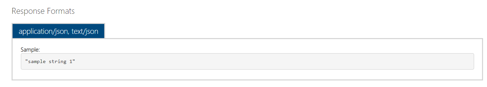

# PaymentAPI

This application provides the basic functionality of a payment gateway through API calls that a merchant can utilise to process payments with banks.

## Features include:
1. .Net MVC/WebAPI 4.7.2
2. Entity Framework 6
3. Client Side
4. Bank simulation

## Azure Devops CICD Pipeline

Please check the CICD link of the projects and Only the automated build has been implemented.The released part has not been implemented due to server hosting

https://dev.azure.com/dhaneshpurdaseea/PaymentAPI

## Solution include:
This Project consist of 3 Parts which is the **ClientSide**, **ApiGateway** and **BankSide**.All of these projects are build on .NET framework 4.7.2
see on different branches:

Backup if branches project are not working :

Client : https://drive.google.com/file/d/1QB0VCowSeUoUhsW85J84QZCWf0KOvhN2/view?usp=sharing

Apigateway : https://drive.google.com/file/d/15viQqJi7xpfQPSYIn1aopURZJsTf2alX/view?usp=sharing

Bankside : https://drive.google.com/file/d/1EgBFGXuM-4SyfHs_jtl919la9pprk6_q/view?usp=sharing

### ClientSide:
The ClientSide is where you can see your previous transaction and can make a payment right now.                                              
**Note:** you need to login to get access to the dashboard and an existing credential will be provide to you

### ApiGateway
The ApiGateway allows to get transaction details from the client to proceed the payment to the bank. It has a Local database on project it stored the transaction details. There two keys which are used to identify the transactions.

 1. Personal_Token (This is generated on the project which allow to identify the User).
 2. Payment_Token (This is generated on the project When a new payment is processed for the user).
 
 
### BankSide
The BankSide is where your transaction is being processed and you can check your balance account by providing your Card Number and CVV number.

If your transaction is approved ,It will return two values to the ApiGateway which are **approval_response** (true or False) and **Payment_Token** (the transaction that has been generated from the ApiGateway).

## API Request
#### ApiGateways Post ####
The following link is used to post a new transaction

 this allow you to post the transaction.

The Request Body Parameters :

The Response Format 

#### ApiGateways Get ####
The following link is used to get all Previous transaction
 this allow you to get previous transaction

The Request Parameters is your Personal token

The Response Parameters :

#### ApiGateways Login ####
when you tried to login on ClientSide to used the API 

 This allow to login and retrieved your credential login and along your personal token
 
 

#### BankSide Post ####
the bank side is used to get transaction parameters from the APIGateway to be processed 
 

The Request body Parameters :

 

## Usage
1. Run the solution BankSide 
2. Run the solution ApiGateway and change the url localhost on Method **UpdateTransaction** where the BankSide is running on the browser
 

3. Run the Solution ClientSide and Change the localhost url link on the Following link where the ApiGateway is running
 
 
 

4. See the GuideApi document to be able to use the API
